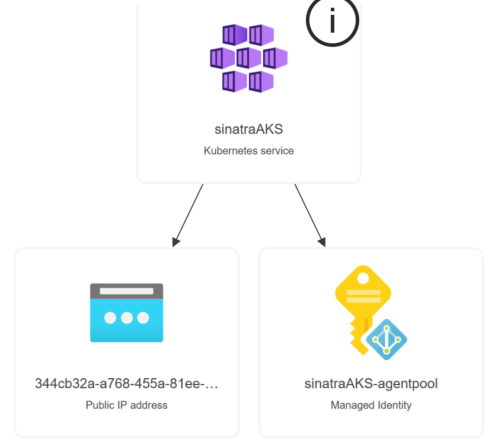
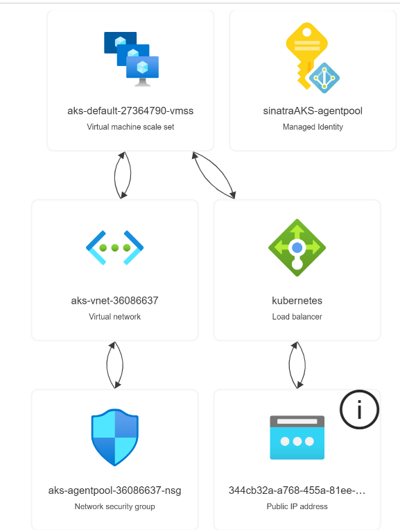

Below is a detailed, step-by-step breakdown of the entire process—from setting up a simple Sinatra app with unpredictable startup timing to deploying versioned “cats” applications on an automated, zero-downtime infrastructure. 

Each step is designed to build on the previous one, ensuring that anyone on your team can replicate the whole process.

### Step 1: Develop & Test the Base Sinatra Application

Initialize the Project Directory:

Create a new folder (sinatra-app).

Initialize a Git repository.

Create necessary folders and files:

app.rb – the main application.

Gemfile – to manage Ruby gem dependencies.

Optionally, add a README.md and a directory for tests.

Create the Sinatra App:

In app.rb:

Require Sinatra and any needed libraries.

Introduce a random delay to simulate unpredictable startup:

        require 'sinatra'

        require 'securerandom'

        # Random delay between 5 and 15 seconds

        delay = rand(5..15)

        sleep(delay)

        get '/' do

        "Welcome to the Sinatra app! (Startup delay: #{delay} seconds)"

        end

        # Create a health-check endpoint

        get '/healthz' do

        status 200

        "OK"

        end

        # Create a metrics endpoint for Prometheus

        get '/metrics' do

        content_type 'text/plain'

        "sinatra_app_started 1\n"

        end

Test locally:

Note: The error message you're seeing means that Windows PowerShell doesn't recognize ruby as a command. 

This usually means Ruby is either not installed or not added to your system's PATH.

## Option 1: Install Ruby (if not already installed)

Go to the official Ruby installer for Windows. 

https://rubyinstaller.org/

Download the latest Ruby+Devkit version.

Run the installer and make sure to check:

✅ “Add Ruby executables to your PATH”

✅ “Run ridk install” at the end (for devkit support)

Option 2: Ruby is installed but not in PATH

Open a new PowerShell or CMD window and run:

   - ruby -v

If you still get an error, Ruby is likely not in your PATH.

Add Ruby to your PATH manually:

Find where Ruby is installed (C:\Ruby31\bin)

Go to System Properties > Environment Variables

Under System variables, find Path, click Edit, and add the path to Ruby’s bin folder

Restart your terminal or your computer, and try again:

   - ruby app.rb

Want to verify installation?

Once it's installed and in your PATH:

   - ruby -v

   - gem -v

Run the app locally using 

   - ruby app.rb

Open the browser to verify that the root URL and the /healthz endpoint work as expected.

Manage Dependencies with Bundler:

In Gemfile:

      source 'https://rubygems.org'

      gem 'sinatra'

      gem 'securerandom'  # (if not included in the standard library for your Ruby version)

Run bundle install to install all dependencies.

## Step 2: Containerize the Sinatra App with Docker

Create a Dockerfile:

In your project directory, add a file named Dockerfile:

dockerfile

      FROM ruby:3.2

WORKDIR /app

# Only copy dependency files first to leverage Docker layer cache

COPY Gemfile Gemfile.lock ./

# Install only production dependencies

RUN bundle install --without development test

# Then copy the rest of the app

COPY . .

# Environment and Port setup

ENV PORT=4567

EXPOSE 4567

# Add random startup time to simulate delayed service

CMD bash -c "sleep $((RANDOM % 10 + 1)) && ruby app.rb -o 0.0.0.0"

      

1. Make sure Docker Desktop is installed

If it’s not installed, download and install it: 

👉 Docker Desktop for Windows: https://docs.docker.com/desktop/setup/install/windows-install/

2. Start Docker Desktop

Search for "Docker Desktop" in the Start menu and open it.

Wait until it says:

✅ Docker is running

3. Switch to Linux containers (if needed)

In Docker Desktop, click the ⚙️ Settings (top-right)

Go to General, make sure "Use the WSL 2 based engine" is checked

If you're using Windows containers, switch to Linux containers:

Right-click the Docker icon in the system tray (bottom right)

Select "Switch to Linux containers..."

4. Restart Terminal

Close and reopen PowerShell or use a new one, then retry:

docker build -t my-sinatra-app .

💡 Pro Tip:

Make sure you're in the right directory — your Dockerfile should be in C:\Users\xxxxx\sinatra-app\app

Build and Run the Docker Image:

   - Run docker build -t my-sinatra-app . to build the image.

   - docker run -p 4567:4567 my-sinatra-app

## Step 3: Provision Infrastructure Using Terraform and Kubernetes

Plan Your Infrastructure:

Define which cloud provider to use (AWS, GCP, or Azure).

Decide on Kubernetes as the deployment platform to take advantage of rolling updates and fault tolerance.

Write Terraform Scripts:

Create a folder (e.g., terraform/) and add configuration files that provision:

A Kubernetes cluster (using EKS, GKE, or AKS).

Networking components (VPC, subnets, security groups).

Load balancers and necessary DNS records.

Document the commands:

   - terraform init

   - terraform plan

   - terraform apply

Use Kubernetes for Deployment:

Prepare Kubernetes manifests (or a Helm chart) that define:

A Deployment for your app, including:

RollingUpdate Strategy:

      strategy:

      type: RollingUpdate

      rollingUpdate:

         maxUnavailable: 0

         maxSurge: 1

Readiness and Liveness Probes:

Point to your /healthz endpoint.

A Service (ClusterIP or LoadBalancer) to expose the application.

An Ingress if using external routing.

Example snippet for a Deployment:

apiVersion: apps/v1

kind: Deployment

metadata:

  name: sinatra-app

spec:

  replicas: 2

  selector:

    matchLabels:

      app: sinatra

  template:

    metadata:

      labels:

        app: sinatra

    spec:

      containers:

        - name: sinatra-container

          image: my-sinatra-app:latest

          ports:

            - containerPort: 4567

          readinessProbe:

            httpGet:

              path: /healthz

              port: 4567

          livenessProbe:

            httpGet:

              path: /healthz

              port: 4567

✅ All files for provisioning infrastructure using Terraform and deploying a Sinatra app with Kubernetes on Azure (AKS) are now created.

.
├── terraform/
│   ├── main.tf            # AKS + networking
│   ├── variables.tf       # Input variables
│   └── outputs.tf         # Output values
├── k8s/
│   ├── deployment.yaml    # Sinatra Deployment
│   ├── service.yaml       # LoadBalancer service
│   └── ingress.yaml       # (Optional) Ingress resource

      ---
      # Folder structure:
      # .
      # ├── terraform/
      # │   ├── main.tf
      # │   ├── variables.tf
      # │   └── outputs.tf
      # ├── k8s/
      # │   ├── deployment.yaml
      # │   ├── service.yaml
      # │   └── ingress.yaml

      # =========================

      # terraform/main.tf

      # =========================

            provider "azurerm" {

      features {}

      subscription_id = "your-azure-subscription-id"  # Replace with your Azure Subscription ID

      }

      resource "azurerm_resource_group" "rg" {

      name     = var.resource_group_name

      location = var.location

      }

      resource "azurerm_kubernetes_cluster" "aks" {

      name                = "sinatraAKS"

      location            = azurerm_resource_group.rg.location

      resource_group_name = azurerm_resource_group.rg.name

      dns_prefix          = "sinatrakube"

      default_node_pool {

         name       = "default"

         node_count = 2

         vm_size    = "Standard_DS2_v2"

      }

      identity {

         type = "SystemAssigned"

      }

      }

      output "kube_config" {

      value     = azurerm_kubernetes_cluster.aks.kube_config_raw

      sensitive = true

      }

      # =========================

      # terraform/variables.tf

      # =========================

      variable "resource_group_name" {

      default = "sinatra-k8s-rg"

      }

      variable "location" {

      default = "East US"

      }

      # =========================

      # terraform/outputs.tf

      # =========================

      output "aks_cluster_name" {

      value = azurerm_kubernetes_cluster.aks.name

      }

      # =========================

      # k8s/deployment.yaml

      # =========================

      apiVersion: apps/v1

      kind: Deployment

      metadata:

      name: sinatra-app

      labels:

         app: sinatra

      spec:

      replicas: 2

      selector:

         matchLabels:

            app: sinatra

      strategy:

         type: RollingUpdate

         rollingUpdate:

            maxUnavailable: 0

            maxSurge: 1

      template:

         metadata:

            labels:

            app: sinatra

         spec:

            containers:

            - name: sinatra-container

               image: my-sinatra-app:latest

               ports:

                  - containerPort: 4567

               readinessProbe:

                  httpGet:

                  path: /healthz

                  port: 4567

               livenessProbe:

                  httpGet:

                  path: /healthz

                  port: 4567

      # =========================

      # k8s/service.yaml

      # =========================

      apiVersion: v1

      kind: Service

      metadata:

      name: sinatra-service

      spec:

      type: LoadBalancer

      selector:

         app: sinatra

      ports:

         - protocol: TCP

            port: 80

            targetPort: 4567

      # =========================

      # k8s/ingress.yaml (optional)

      # =========================

      apiVersion: networking.k8s.io/v1

      kind: Ingress

      metadata:

      name: sinatra-ingress

      annotations:

         nginx.ingress.kubernetes.io/rewrite-target: /

      spec:

      rules:

         - host: sinatra.example.com

            http:

            paths:

               - path: /

                  pathType: Prefix

                  backend:

                  service:

                     name: sinatra-service

                     port:

                        number: 80

      # =========================

      # Usage Documentation below:

      # =========================
    

    Options to Resolve the subscription_id Requirement

Option 1: Specify it in the Provider Block

You can update your provider block in your main.tf to include your subscription ID:

      provider "azurerm" {

      features {}

      subscription_id = "your-azure-subscription-id"  # Replace with your actual Subscription ID

      }

Option 2: Use Environment Variables

If you prefer not to hardcode your subscription, set the following environment variable before running Terraform:

On Windows (PowerShell):

$env:ARM_SUBSCRIPTION_ID = "your-azure-subscription-id"

On Linux/macOS:

export ARM_SUBSCRIPTION_ID="your-azure-subscription-id"

Then, run your Terraform commands:

🚀 Run these commands:

   - cd terraform

   - terraform init

   - terraform plan

   - terraform apply

   

   

   

After reviewing the Terraform documentation and community best practices, the command to destroy your deployed resources is:

   - terraform destroy

# Then deploy app to AKS:

kubectl apply -f ../k8s/deployment.yaml

kubectl apply -f ../k8s/service.yaml

kubectl apply -f ../k8s/ingress.yaml  # if using ingress

1. Clone and Checkout Version 1.0.0

a. Clone the Repository:

Open your terminal and run:

   - git clone https://github.com/Streetbees/cats

This command creates a local copy of the repository.

b. Check Out the Tag for Version 1.0.0:

Navigate into the cloned repository directory and check out the specified tag:

   - cd cats

   - git checkout tags/1.0.0 -b release-1.0.0

Here, release-1.0.0 is a new branch created from the tag for local modifications if needed.

2. Containerize the Cats App

a. Verify or Add a Dockerfile:

Ensure that there is a Dockerfile at the root of the repository. If not, create one. A basic example might look like:

# Use an official Ruby image if it is a Ruby app, or the appropriate base image for the language

      FROM ruby:3.0

      # Set the working directory

      WORKDIR /app

      # Copy the Gemfile and install dependencies if it's a Ruby app

      COPY Gemfile Gemfile.lock ./

      RUN bundle install

      # Copy the application code

      COPY . .

      # Expose the port the app runs on. Replace 8080 with the appropriate port.

      EXPOSE 8080

      # Run the application

      CMD ["ruby", "app.rb"]

Adjust the Dockerfile as required by the Cats application's technology stack.

b. Build the Docker Image:

Run the following command to build the image and tag it as version 1.0.0:

   - docker build -t cats:1.0.0 .

3. Prepare Kubernetes Artifacts

You need to create Kubernetes manifest files (YAML files) that define how your app will run in the cluster.

a. Deployment Manifest:

Create a file named cats-deployment.yaml with contents similar to the following:

apiVersion: apps/v1

kind: Deployment

metadata:

  name: cats-app

  labels:

    app: cats

spec:

  replicas: 3  # Multiple replicas for high availability

  selector:

    matchLabels:

      app: cats

  template:

    metadata:

      labels:

        app: cats

    spec:

      # Anti-affinity rules ensure pods aren't scheduled on the same node

      affinity:

        podAntiAffinity:

          requiredDuringSchedulingIgnoredDuringExecution:

            - labelSelector:

                matchExpressions:

                  - key: app

                    operator: In

                    values:

                      - cats

              topologyKey: "kubernetes.io/hostname"

      containers:

        - name: cats-container

          image: cats:1.0.0

          ports:

            - containerPort: 8080

          readinessProbe:

            httpGet:

              path: /health   # Replace with your app's health endpoint

              port: 8080

            initialDelaySeconds: 5

            periodSeconds: 10

          livenessProbe:

            httpGet:

              path: /health   # Replace with your app's health endpoint

              port: 8080

            initialDelaySeconds: 15

            periodSeconds: 20

b. Service Manifest:

Create a file named cats-service.yaml:

apiVersion: v1

kind: Service

metadata:

  name: cats-service

spec:

  selector:

    app: cats

  ports:

    - protocol: TCP

      port: 80      # Port for external traffic

      targetPort: 8080  # Port your container exposes

  type: LoadBalancer   # Choose NodePort if you don't have a cloud LB set up
  
c. Optional: Helm Chart

If you'd prefer to use Helm for templating and easier management:

Run helm create cats to scaffold a basic chart.

Replace default templates with your customized Deployment and Service definitions.

Use Helm values (values.yaml) to manage variable parts like replica count, image tag, and port numbers.

4. Deploy to Kubernetes

a. Apply Kubernetes Manifests:

Assuming you are using kubectl and your manifests are ready, deploy the application with:

   - kubectl apply -f cats-deployment.yaml

   - kubectl apply -f cats-service.yaml

These commands will create the Deployment and Service in your Kubernetes cluster.

b. Verify Deployment:

Monitor your pods and services:

   - kubectl get pods

   - kubectl get svc

Ensure that the pods are running, and the service has an external IP if using a LoadBalancer.

c. Using Helm (Alternative):

If you are using a Helm chart, deploy it with:

   - helm install cats-release ./cats

Replace cats-release with your chosen release name and adjust the path accordingly.

Step 4: Deploy Version 1.0.0 of the Cats Application

Clone and Checkout Version 1.0.0:

Clone the repository:

   - git clone https://github.com/Streetbees/cats

Check out the tag for version 1.0.0.

Containerize the Cats App:

Ensure there is a Dockerfile in the repository (or add one similar to the one in Step 2).

Prepare Kubernetes Artifacts:

Write Deployment and Service manifests for the cats app.

Ensure the Deployment configuration includes multiple replicas, anti-affinity rules, and proper health checks.

Use a Helm chart if you’d like to template these configurations.

Deploy to Kubernetes:

Apply the Kubernetes manifest using kubectl apply -f <manifest.yaml> or use Helm to deploy.

Step 5: Automate Upgrades to Version 2.0.1 Without Downtime

Set Up a CI/CD Pipeline:

Configure GitHub Actions, Jenkins, or another CI tool to react to version tag changes.

Pipeline Tasks:

Checkout Source Code: Pull the repository when a commit or tag (v2.0.1) is pushed.

Build & Test: Run the build, unit tests, and integration tests.

Build a New Docker Image: Tag the image with v2.0.1.

Deploy: Update the Kubernetes Deployment by invoking a Helm upgrade:

helm upgrade cats-release ./charts/cats --set image.tag=v2.0.1

Alternatively, implement a blue-green or canary deployment strategy:

Deploy version 2.0.1 to a new set of pods.

Monitor the new pods using /healthz before directing full traffic to them.

Automate Rollback if Necessary:

Ensure your deployment configuration allows for an easy rollback via Helm or Kubernetes’ native rollback features.

Step 6: Enhance the Application with DevOps-Friendly Features

Health Endpoint:

Already include /healthz in your Sinatra code.

Metrics Endpoint:

Already expose /metrics to allow Prometheus scraping.

Structured Logging:

Configure your Ruby logger to output in JSON format. This can be integrated with centralized logging systems like ELK or Loki.

Additional Observability:

Consider adding instrumentation libraries (for distributed tracing such as Jaeger) if needed.

Repository Structure:

Organize files in directories such as:

project-root/
├── app/                 # Sinatra app and Dockerfile
├── terraform/           # Terraform configuration files
├── charts/              # Helm chart for Kubernetes
├── .github/workflows/   # CI/CD pipeline configurations
└── README.md            # Full instructions, architecture diagrams, and runbooks

README.md:

Write detailed instructions on how to:

Run the app locally.

Build and deploy Docker images.

Provision infrastructure using Terraform.

Deploy to Kubernetes.

Upgrade from version 1.0.0 to 2.0.1 with no downtime.

Diagrams & Runbooks:

Include architectural diagrams and operational runbooks (for scaling, rolling back, and monitoring).

Step 8: Justify Tooling Decisions (Pros & Cons)

Docker:

Pros: Reproducible builds, simplified dependency management, environment consistency.

Cons: Overhead in image security management and orchestration.

Kubernetes:

Pros: Native support for rolling updates, autoscaling, self-healing.

Cons: Complexity in configuration and a steeper learning curve.

Terraform:

Pros: Infrastructure as Code provides repeatability and version control.

Cons: Troubleshooting state drift and state file management.

Helm & CI/CD:

Pros: Streamlined deployments; ability to roll back seamlessly.

Cons: Complex templating could lead to human error if not documented properly.

Monitoring Stack (Prometheus, Grafana, ELK/Loki):

Pros: Comprehensive insights into system performance and faster troubleshooting.

Cons: Requires initial setup time, calibration of alerts, and ongoing operational overhead.

Step 9: Implement Monitoring and Observability

Setup Metrics Collection:

Add /metrics endpoints in all services.

Deploy Prometheus to scrape these endpoints.

Log Aggregation:

Use a centralized logging stack such as ELK (Elasticsearch, Logstash, Kibana) or Loki.

Configure a log forwarder (Fluent Bit or Logstash) to collect logs from your containers.

Distributed Tracing (Optional):

Integrate tracing libraries to monitor end-to-end requests using Jaeger or Zipkin.

Dashboarding & Alerts:

Set up Grafana dashboards to monitor:

Application response times and error rates.

Resource utilization (CPU, memory) of pods.

Deployment health (pod startups, rolling update metrics).

Configure alerts for abnormal spikes or failures.

Final Workflow Summary

Local Development:

Develop the Sinatra application with simulated delay.

Containerize with Docker and test locally.

Infrastructure Provisioning:

Use Terraform to create a Kubernetes cluster and related resources.

Deploy Version 1.0.0 (Cats App):

Containerize, deploy via Kubernetes manifests/Helm, and set up fault tolerance.

Automated Upgrade to Version 2.0.1:

Employ a CI/CD pipeline that builds, tests, and deploys the new version using rolling updates or blue-green deployment.

Enhancements and Monitoring:

Add health checks, metrics endpoints, structured logging, and tracing.

Set up Prometheus, Grafana, and central logging.

Documentation & Runbooks:

Provide thorough written documentation that includes repository structure, deployment procedures, rollback instructions, and architecture diagrams.

### Expected output:

